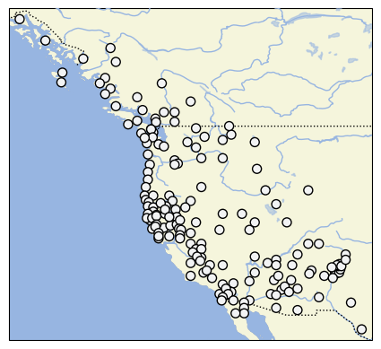

# D-PLACE dataset derived from Jorgensen 1980 'Western Indians'

## How to cite

If you use these data please cite
- the original source
  > Jorgensen, JG. 1980. Western Indians: Comparative Environments, Languages, and Cultures of 172 Western American Indian Tribes. San Francisco: W.H. Freeman and Company.
- the derived dataset using the DOI of the [particular released version](../../releases/) you were using

## Description

The Western North American Indians (WNAI) dataset describes cultural practices for 172 societies in Western North America.

This dataset is licensed under a CC-BY-NC-4.0 license

Available online at https://archive.org/details/westernindiansco0000jorg

## CLDF Datasets

The following CLDF datasets are available in [cldf](cldf):

- CLDF [StructureDataset](https://github.com/cldf/cldf/tree/master/modules/StructureDataset) at [cldf/StructureDataset-metadata.json](cldf/StructureDataset-metadata.json)